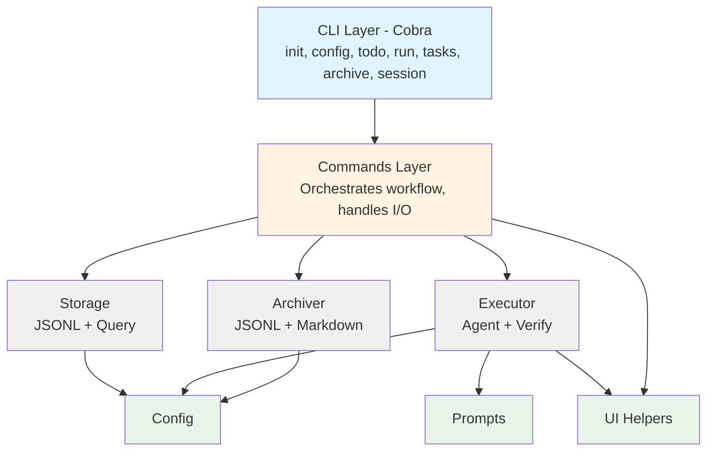

# devloop Architecture

This diagram shows the layered architecture of the devloop system.

## Component Descriptions

### CLI Layer

Entry point using Cobra framework. Provides command-line interface with subcommands:

- **init**: Initialize devloop in a project
- **config**: View and validate configuration
- **todo**: Process TODO items into tasks
- **run**: Execute the development workflow
- **tasks**: Manage and view tasks
- **archive**: Archive completed waves
- **session**: Manage execution sessions

### Commands Layer

Orchestrates workflows by coordinating between storage, executor, and other components. Handles user I/O and error reporting.

### Core Components

- **Storage**: JSONL-based task storage with in-memory querying and filtering
- **Executor**: Task execution engine with AI agent integration and verification
- **Archiver**: Archives completed waves to JSONL and markdown summaries

### Support Components

- **Config**: Configuration management and validation
- **Prompts**: AI prompt templates for task execution and TODO processing
- **UI**: Terminal formatting helpers (colors, tables, progress indicators)
