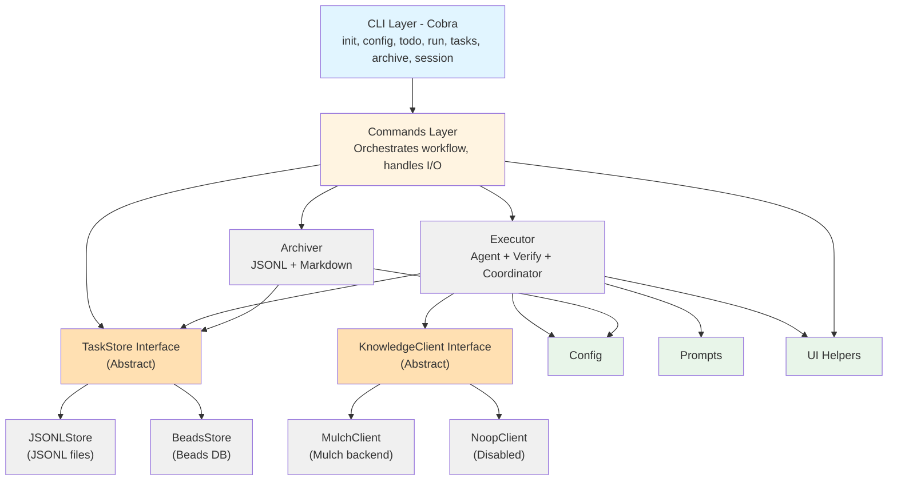

# devloop Architecture

This diagram shows the layered architecture of the devloop system.

## Component Descriptions

### CLI Layer

Entry point using Cobra framework. Provides command-line interface with subcommands:

- **init**: Initialize devloop in a project
- **config**: View and validate configuration
- **todo**: Process TODO items into tasks
- **run**: Execute the development workflow
- **tasks**: Manage and view tasks
- **archive**: Archive completed tasks
- **session**: Manage execution sessions

### Commands Layer

Orchestrates workflows by coordinating between storage, executor, and other components. Handles user I/O and error reporting.

### TaskStore Interface

Defines the contract for task persistence and querying:

- **JSONLStore**: File-based implementation using JSONL format
  - Stores tasks in `.devloop/tasks.jsonl`
  - In-memory querying and filtering
  - Suitable for single-user development workflows
- **BeadsStore**: High-performance database implementation
  - Uses Beads distributed database
  - Supports concurrent access and synchronization
  - Optimized for large-scale task management
  - Includes Syncer and Compactor interfaces for maintenance

### KnowledgeClient Interface

Manages knowledge base interactions and context priming:

- **MulchClient**: Knowledge base backend
  - Records knowledge from completed tasks
  - Primes execution context with relevant information
  - Enables contextual AI agent execution
- **NoopClient**: No-op implementation
  - Used when knowledge management is disabled
  - Returns empty priming context

### Core Components

- **Executor**: Task execution engine with AI agent integration, verification, and optional coordinator
  - Injects knowledge context into task prompts
  - Runs coordinator agent as optional pre-step for complex tasks
  - Handles retries, verification, and auto-commits
  - Manages session checkpointing
- **Archiver**: Archives completed tasks to JSONL and markdown summaries

### Support Components

- **Config**: Configuration management and validation
- **Prompts**: AI prompt templates for task execution and TODO processing
- **UI**: Terminal formatting helpers (colors, tables, progress indicators)

