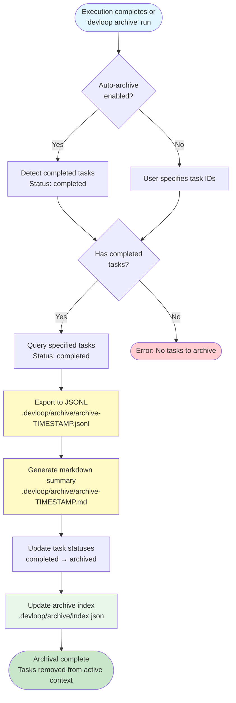

# Archive Workflow

This diagram shows how completed tasks are archived to prevent context bloat.



## Archival Details

### Archive Directory Structure

```text
.devloop/archive/
├── index.json                    # Archive metadata index
├── archive-2026-02-17.jsonl      # Task data (machine-readable)
├── archive-2026-02-17.md         # Summary (human-readable)
├── archive-2026-02-18.jsonl
├── archive-2026-02-18.md
└── ...
```

### JSONL Export Format

Each line is a complete task object:

```jsonl
{"id":"DEV-1","title":"Setup project","status":"archived","completed_at":"2026-02-17T03:00:00Z",...}
{"id":"DEV-2","title":"Add config","status":"archived","completed_at":"2026-02-17T03:15:00Z",...}
```

### Markdown Summary Format

Human-readable summary with:

- **Archive header**: Archive date and completion timestamp
- **Statistics**: Total tasks, attempts, duration
- **Task details**: For each task:
  - ID and title
  - Complexity badge
  - Description
  - Acceptance criteria
  - Completion timestamp
  - Number of attempts
  - Commit hash (if auto-commit enabled)

### Archive Index

Located at `.devloop/archive/index.json`:

```json
{
  "archives": [
    {
      "archived_at": "2026-02-17T03:30:00Z",
      "task_count": 6,
      "task_ids": ["DEV-1", "DEV-2", "DEV-3", "DEV-4", "DEV-5", "DEV-6"],
      "output_path": ".devloop/archive/archive-2026-02-17"
    }
  ]
}
```

## Archival Triggers

### Automatic Archival

When `config.archival.auto_archive` is enabled:

- Triggered after task execution completes
- Only archives completed tasks
- Runs at the end of `devloop run` execution

### Manual Archival

Users can manually archive with:

```bash
# Archive specific tasks
devloop archive --tasks DEV-1,DEV-2

# Auto-detect and archive all completed tasks
devloop archive --auto
```

## Benefits

- **Reduced Context**: Archived tasks don't appear in `devloop tasks list`
- **Preserved History**: Full task data saved in both machine and human formats
- **Git-Friendly**: JSONL and markdown are both version-controllable
- **Queryable**: Can still search archived JSONL with standard tools
- **Reversible**: Can restore tasks from archive if needed
