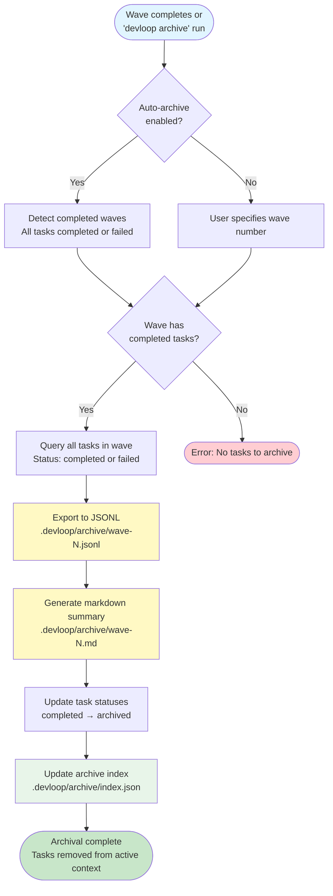

# Archive Workflow

This diagram shows how completed waves are archived to prevent context bloat.



## Archival Details

### Archive Directory Structure

```text
.devloop/archive/
├── index.json          # Archive metadata index
├── wave-1.jsonl        # Task data (machine-readable)
├── wave-1.md           # Summary (human-readable)
├── wave-2.jsonl
├── wave-2.md
└── ...
```

### JSONL Export Format

Each line is a complete task object:

```jsonl
{"id":"DEV-1","title":"Setup project","status":"archived","completed_at":"2026-02-17T03:00:00Z",...}
{"id":"DEV-2","title":"Add config","status":"archived","completed_at":"2026-02-17T03:15:00Z",...}
```

### Markdown Summary Format

Human-readable summary with:

- **Wave header**: Wave number and completion timestamp
- **Statistics**: Total tasks, attempts, duration
- **Task details**: For each task:
  - ID and title
  - Complexity badge
  - Description
  - Acceptance criteria
  - Completion timestamp
  - Number of attempts
  - Commit hash (if auto-commit enabled)

### Archive Index

Located at `.devloop/archive/index.json`:

```json
{
  "1": {
    "wave": 1,
    "archived_at": "2026-02-17T03:30:00Z",
    "task_count": 6,
    "task_ids": ["DEV-1", "DEV-2", "DEV-3", "DEV-4", "DEV-5", "DEV-6"],
    "output_path": ".devloop/archive/wave-1"
  }
}
```

## Archival Triggers

### Automatic Archival

When `config.archival.auto_archive` is enabled:

- Triggered after all tasks in a wave complete
- Only archives if **all** tasks are completed or failed (no pending tasks)
- Runs at the end of `devloop run` execution

### Manual Archival

Users can manually archive with:

```bash
# Archive specific wave
devloop archive --wave 1

# Auto-detect and archive all completed waves
devloop archive --auto
```

## Benefits

- **Reduced Context**: Archived tasks don't appear in `devloop tasks list`
- **Preserved History**: Full task data saved in both machine and human formats
- **Git-Friendly**: JSONL and markdown are both version-controllable
- **Queryable**: Can still search archived JSONL with standard tools
- **Reversible**: Can restore tasks from archive if needed
