# Project Structure

This diagram shows the directory layout and organization of the devloop project.

```mermaid
graph TD
    ROOT[devloop/]
    
    CMD[cmd/devloop/]
    MAIN[main.go - CLI entry point]
    
    INTERNAL[internal/]
    AGENT[agent/ - AI CLI runner]
    ARCHIVER[archiver/ - Archive system]
    COMMANDS[commands/ - Cobra commands]
    CONFIG[config/ - Config management]
    EXECUTOR[executor/ - Execution engine]
    PROCESSOR[processor/ - TODO processing]
    PROMPTS[prompts/ - AI templates]
    STORAGE[storage/ - JSONL operations]
    UI[ui/ - Terminal formatting]
    
    DOCS[docs/]
    DESIGN[DESIGN.md]
    TASKS[TASKS.md]
    GETTING[GETTING_STARTED.md]
    AGENT_INST[AGENT_INSTRUCTIONS.md]
    DIAGRAMS[diagrams/]
    
    EXAMPLES[examples/]
    SAMPLE[sample-todo.md]
    
    DEVLOOP[.devloop/]
    CONFIG_JSON[config.json]
    TASKS_JSONL[tasks.jsonl]
    LOGS[logs/]
    ARCHIVE[archive/]
    STATE[state/]
    
    ROOT --> CMD
    CMD --> MAIN
    
    ROOT --> INTERNAL
    INTERNAL --> AGENT
    INTERNAL --> ARCHIVER
    INTERNAL --> COMMANDS
    INTERNAL --> CONFIG
    INTERNAL --> EXECUTOR
    INTERNAL --> PROCESSOR
    INTERNAL --> PROMPTS
    INTERNAL --> STORAGE
    INTERNAL --> UI
    
    ROOT --> DOCS
    DOCS --> DESIGN
    DOCS --> TASKS
    DOCS --> GETTING
    DOCS --> AGENT_INST
    DOCS --> DIAGRAMS
    
    ROOT --> EXAMPLES
    EXAMPLES --> SAMPLE
    
    ROOT --> DEVLOOP
    DEVLOOP --> CONFIG_JSON
    DEVLOOP --> TASKS_JSONL
    DEVLOOP --> LOGS
    DEVLOOP --> ARCHIVE
    DEVLOOP --> STATE
    
    ROOT --> GOMOD[go.mod]
    ROOT --> README[README.md]
    ROOT --> CLAUDE[CLAUDE.md]
    ROOT --> JUSTFILE[justfile]
    
    style ROOT fill:#e1f5ff
    style INTERNAL fill:#fff4e1
    style DOCS fill:#e8f5e9
    style DEVLOOP fill:#f3e5f5
    style CMD fill:#fff9c4
```

## Directory Descriptions

### Source Code

- **`cmd/devloop/`**: CLI entry point with main.go
- **`internal/`**: Core packages (not exported as library)
  - **`agent/`**: AI CLI runner abstraction (Claude, Copilot, etc.)
  - **`archiver/`**: Archive completed waves to JSONL and markdown
  - **`commands/`**: Cobra command implementations
  - **`config/`**: Configuration schema, loading, and validation
  - **`executor/`**: Task execution engine with verification
  - **`processor/`**: TODO file parsing and task generation
  - **`prompts/`**: AI agent prompt templates
  - **`storage/`**: JSONL operations and in-memory task index
  - **`ui/`**: Terminal output helpers (colors, tables, progress)

### Documentation

- **`docs/`**: Architecture and usage documentation
  - **`DESIGN.md`**: System architecture and design decisions
  - **`TASKS.md`**: Implementation roadmap with task details
  - **`GETTING_STARTED.md`**: Setup and development guide
  - **`AGENT_INSTRUCTIONS.md`**: Coding guidelines for AI agents
  - **`diagrams/`**: Mermaid diagrams (architecture, flows)

### Project State (`.devloop/`)

Created by `devloop init`, stores per-project state:

- **`config.json`**: Project configuration
- **`tasks.jsonl`**: Active task storage (one JSON object per line)
- **`logs/`**: Execution logs (agent output, verification results)
- **`archive/`**: Archived completed waves (JSONL + markdown)
- **`state/`**: Session state for crash recovery

### Other Files

- **`examples/`**: Sample TODO files and configurations
- **`go.mod`, `go.sum`**: Go module dependencies
- **`README.md`**: Main project documentation
- **`CLAUDE.md`**: Claude-specific development guidance
- **`justfile`**: Build and test commands
- **`.gitignore`**: Git exclusion patterns
