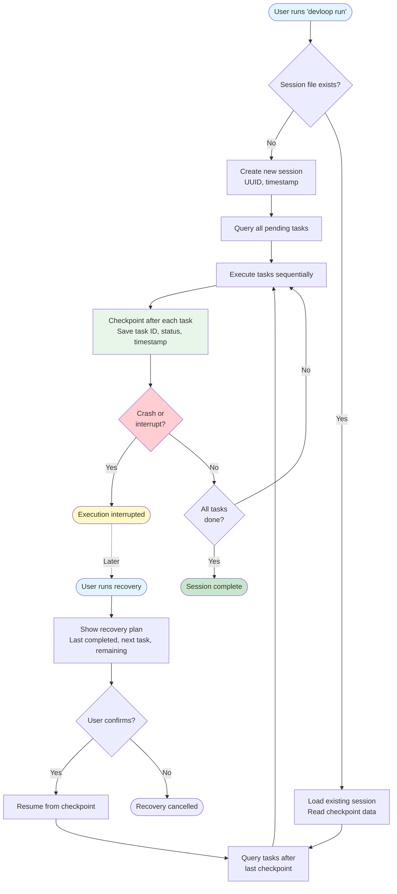

# Session Recovery Flow

This diagram shows how devloop handles crashes and resumes execution from checkpoints.



## Session Management

### Session File Structure

Located at `.devloop/state/session.json`:

```json
{
  "id": "uuid-here",
  "started_at": "2026-02-17T03:00:00Z",
  "last_checkpoint": "DEV-3",
  "tasks_completed": ["DEV-1", "DEV-2", "DEV-3"],
  "tasks_failed": []
}
```

### Checkpoint Strategy

After each task execution (success or failure):

1. Update session with task ID and outcome
2. Save session file to disk
3. Continue to next task

This ensures that if devloop crashes or is interrupted, it can resume from the last successfully checkpointed task.

### Recovery Process

When running `devloop session recover`:

1. **Load Session**: Read the last session file
2. **Identify Checkpoint**: Find the last completed task ID
3. **Query Remaining**: Get all tasks after the checkpoint
4. **Display Plan**: Show user what will be resumed
5. **Confirm**: Wait for user approval
6. **Resume**: Continue execution from checkpoint

### Manual Resume

Users can also manually resume with:

```bash
devloop run --continue
```

This automatically loads the last session and continues from the checkpoint without additional prompts.

### Edge Cases

- **No Session**: If no session exists, creates a new one and starts from the beginning
- **All Tasks Complete**: Recovery exits gracefully if checkpoint shows all tasks are done
- **Corrupted Session**: If session file is invalid, prompts user to start fresh or recover manually
