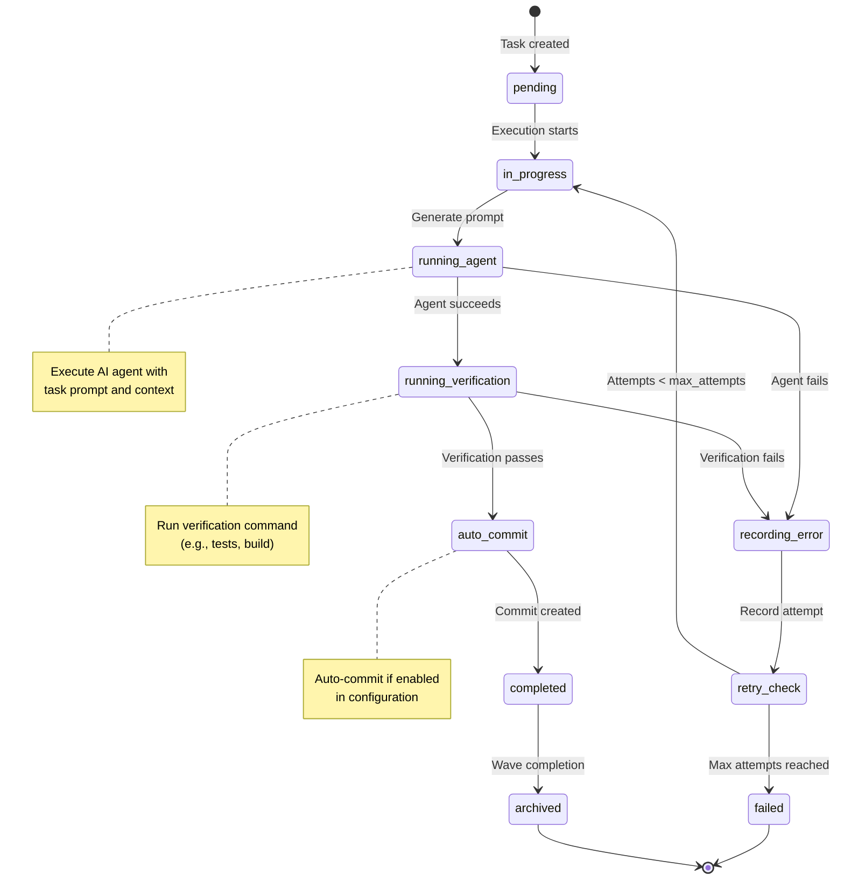

# Task Execution Flow

This diagram shows the lifecycle of a task from pending to completion or failure.

## Execution Details

### Task States

- **pending**: Task created but not yet started
- **in_progress**: Task execution has begun
- **completed**: Task finished successfully with verification passed
- **failed**: Task failed after all retry attempts exhausted
- **archived**: Completed task moved to archive when wave completes

### Execution Steps

1. **Generate Prompt**: Build AI agent prompt with task context, project info, and previous errors (if retry)
2. **Run Agent**: Execute AI CLI tool (Claude, Copilot, etc.) with selected model based on complexity
3. **Verify**: Run project-specific verification command (tests, build, lint, etc.)
4. **Auto-commit**: Create git commit if verification passes and auto-commit is enabled
5. **Retry Logic**: If agent or verification fails, retry up to `max_attempts` configured in settings

### Checkpointing

After each task completes or fails, the session state is checkpointed to enable crash recovery.
