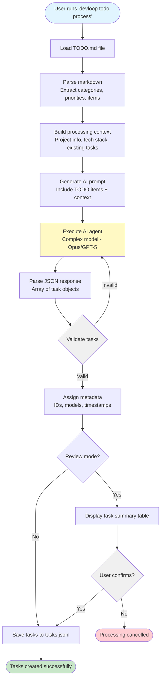

# TODO Processing Workflow

This diagram shows how TODO items are converted into structured tasks using AI agents.



## Processing Details

### Input Format

TODO items in markdown format:

```markdown
## Wave 1: Core Infrastructure

### High Priority
- [ ] Task description here
- [ ] Another task

### Medium Priority
- [ ] Task description
```

### AI Agent Processing

The AI agent (using a complex model like Opus or GPT-5) analyzes TODO items and generates structured tasks with:

- **Hierarchical IDs**: Assigns IDs like "1.1", "1.2", "2.1" based on wave and sequence
- **Complexity Assessment**: Determines if task is simple/moderate/complex
- **Model Selection**: Maps complexity to appropriate AI model
- **Dependencies**: Identifies blockedBy relationships between tasks
- **Acceptance Criteria**: Generates specific, testable success criteria

### Task Metadata

Each generated task includes:

- `id`: Hierarchical or JIRA-style identifier
- `title`: Brief task description
- `description`: Detailed requirements
- `complexity`: simple | moderate | complex
- `model`: AI model to use for execution
- `status`: Initially set to "pending"
- `acceptance_criteria`: List of success requirements
- `dependencies`: Tasks that must complete first
- `created_at`, `updated_at`: Timestamps

### Review Mode

When `--review` flag is used, the system displays all generated tasks in a table and prompts for confirmation before saving to storage. This allows users to verify the AI's task breakdown before committing.
